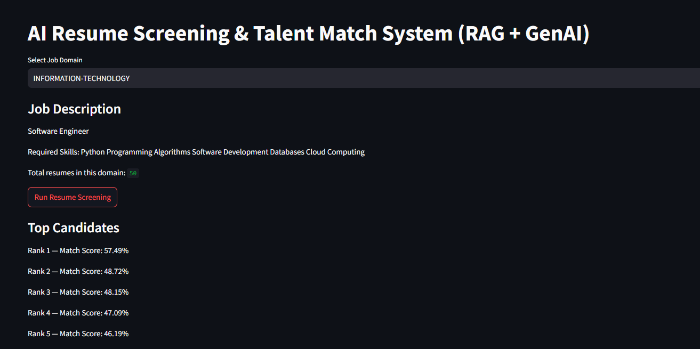
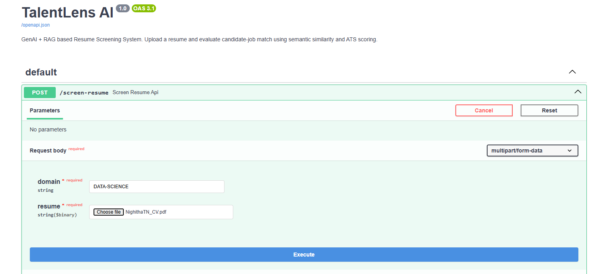
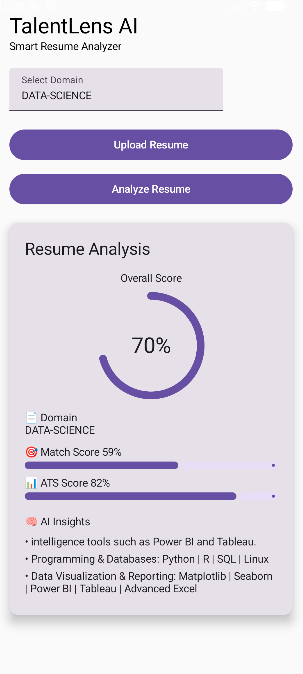

# TalentLens AI 🚀

AI-powered Resume Screening & Talent Match System using GenAI + RAG + NLP

## Overview

TalentLens AI is an intelligent recruitment system that automates resume screening by comparing resumes with job descriptions using semantic similarity, ATS scoring, and AI-based evaluation. This project demonstrates a real-world application of AI in hiring systems.

## Key Features

- Resume Upload (PDF)
- AI Match Score (Semantic Similarity)
- ATS Score (Keyword Matching)
- RAG-based Resume Analysis
- AI Candidate Evaluation
- FastAPI Backend API
- Streamlit Prototype UI
- Android App Integration

## Technologies Used

- Python
- Streamlit (Prototype UI)
- FastAPI (Backend API)
- Sentence Transformers (Embeddings)
- LangChain (RAG)
- LLM (Groq / LLaMA)
- Scikit-learn (Cosine Similarity)
- pdfplumber (PDF Processing)
- NumPy

## System Architecture

Resume (PDF) → Text Extraction → Text Chunking → Embeddings → Cosine Similarity → RAG → LLM → Final Output (Match Score + ATS Score + Analysis)

## Screenshots

Streamlit UI  

FastAPI Swagger  

Android App  

## Installation

git clone https://github.com/nighithatn/TalentLens-AI.git  
cd TalentLens-AI  
pip install -r requirements.txt  

## Run Streamlit App (Prototype UI)

streamlit run app.py  

## Run FastAPI Backend

uvicorn api:app --reload  

Open in browser: http://127.0.0.1:8000/docs

## API Endpoint

POST /screen-resume  

Input:  
- Domain (e.g., DATA-SCIENCE)  
- Resume (PDF file)  

Output example:  
{  
  "domain": "DATA-SCIENCE",  
  "match_score (%)": 84.5,  
  "ats_score (%)": 76.2,  
  "analysis": "Candidate demonstrates strong skills in Python, Machine Learning, and Data Analysis."  
}  

## Android Integration

The Android application connects to the FastAPI backend and allows users to upload resumes, select job domain, and view AI-generated results including match score, ATS score, and analysis.

## Demo Usage

Test the system using Data Science, HR, or IT resumes. You can also upload your own resume for evaluation.

## Project Structure

TalentLens-AI/  
│  
├── app.py  
├── api.py  
├── ai_engine.py   
├── requirements.txt    
├── README.md  
├── resume_ai.ipynb   
│   
  

## Author

Nighitha T N  

## Conclusion

TalentLens AI demonstrates how AI, RAG, and GenAI can transform traditional recruitment into an intelligent and automated system.

⭐ Star this repo if you like it!
